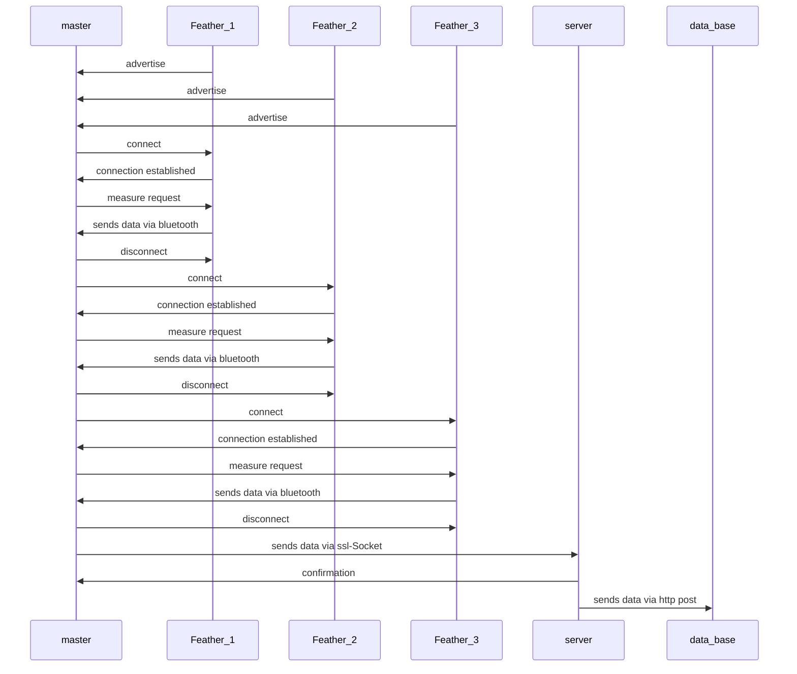

```mermaid
sequenceDiagram
    participant master
    participant Feather_1
    participant Feather_2
    participant Feather_3
    participant server
    participant data_base

    Feather_1 ->> master: advertise
    Feather_2 ->> master: advertise
    Feather_3 ->> master: advertise
    master->>Feather_1: connect
    Feather_1->>master: connection established
    master->>Feather_1: measure request
    Feather_1->>master: sends data via bluetooth
    master->>Feather_1: disconnect
    master->>Feather_2: connect
    Feather_2->>master: connection established
    master->>Feather_2: measure request
    Feather_2->>master: sends data via bluetooth
    master->>Feather_2: disconnect
    master->>Feather_3: connect
    Feather_3->>master: connection established
    master->>Feather_3: measure request
    Feather_3->>master: sends data via bluetooth
    master->>Feather_3: disconnect
    master->>server: sends data via ssl-Socket
    server ->> master: confirmation
    server ->> data_base: sends data via http post
```
