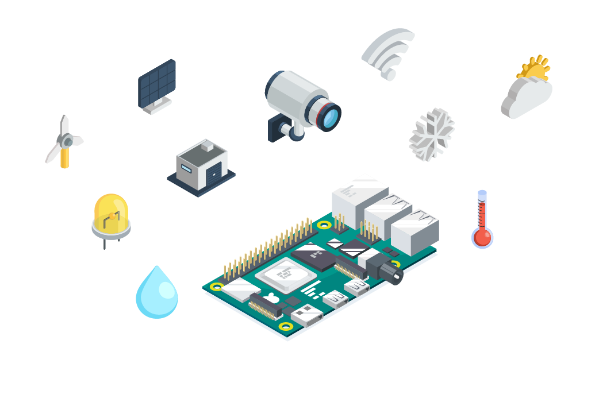
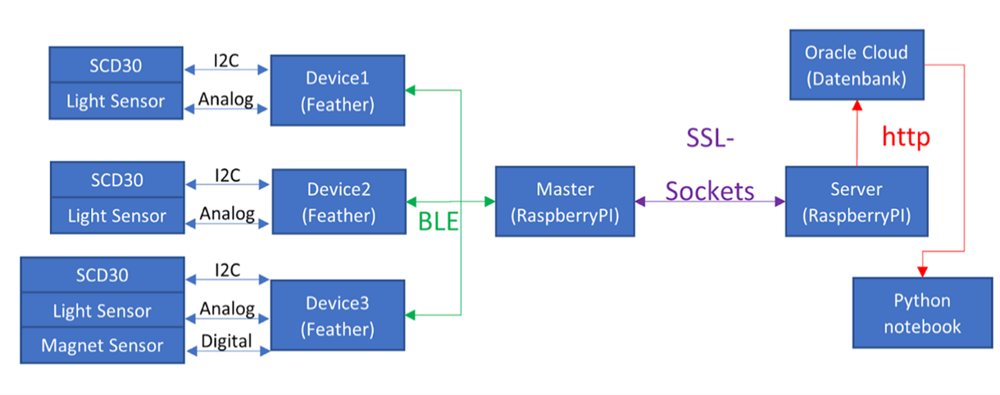
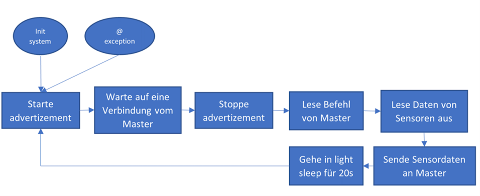

<!-- Improved compatibility of back to top link: See: github-link -->

<!-- logo einfügen mit Ordner namens "images" -->
 

  

  <h2 align="center">Smart Classroom</h3>

  

    In diesem Repository wird die Smart Classroom Challange des Studienganges BSc Datascience der Fachhochschule Nordwestschweiz berarbeitet.
     
    Ziel dieser Challenge ist es mithilfe von IoT- Sensoren die optimalen Lüftungsparameter für ein Schulzimmer zu definieren.
     
    Sie finden die Firmware, den Aufbau der Mikrokontroller, die 3D-Druckdateien der Gehäuse sowie die gesamte Datenanalyse.
  

<!-- TABLE OF CONTENTS -->
  
<h2>Inhaltsverzeichnis<h3 />

  <ol>
    <li><a href="#projektbeschrieb">Projektbeschrieb</a></li>
    <li><a href="#Repository-Aufbau">Repository-Aufbau</a></li>
    <li><a href="#Datenablauf">Datenablauf</a></li>
    <li><a href="#Firmware">Firmware</a></li>
    <li><a href="#Hardware">Hardware</a></li>
    <li><a href="#kontakt">Kontakt</a></li>
  </ol>

<!-- PROJEKTBESCHRIEB -->
### Projektbeschrieb
Mittels verschiedenen Mikrokontroller und Sensoren wird eine automatisierte Datenübertragung auf eine Relationale Datenbank gewährleistet.
 
Die Daten wurden im Schulzimmer einer Primarklasse erhoben und anschliessend in diversen Jupyter Notebooks analysiert.
 
Um die Mikrokontroller zu schützen wurden Gehäuse konstruiert und anschliessend mit einem SLS 3D-Drucker produziert.
 

(<a href="#readme-top">back to top</a>)

<!-- Repository-Aufbau -->
### Repository-Aufbau

:file_folder: Abgabe komplett -> Alle benötigten Dateien und Skripte in einem Ordner zusammengefasst  
:file_folder: Box -> Enthält die STL-Dateien für den 3D-Druck der Gehäuse  
:file_folder: Hardware -> Die wichtigsten Informationen und Beschriebe der Hardware  

(<a href="#readme-top">back to top</a>)

<!-- Datenablauf -->
### Datenablauf

Die Sensordaten wurden insgesamt von drei Mikrokontroller aufgenommen und mittels BLE an einen Raspberrypi zero gesendet.
Dieser sendete Die Daten über Wlan an einen Server, welcher wiederum die Daten an die REST API der Datenbank sendet.

(<a href="#readme-top">back to top</a>)

<!-- Firmware -->
### Firmware

**Ablauf**:  
Der Feather beginnt zu advertizen und wartet auf eine Verbindung vom Master.
Sobald eine Verbindung aufgebaut wurde, wird das Advertising gestoppt und auf den Lese-Befehl vom Master gewartet.
Wird dieser Befehl erteilt, werden die Sensoren ausgelesen, zu einem JSON konvertiert und an den Master gesendet. Der Master schliesst nun die Verbindung und der Feather geht in einen light-Sleep für 20s (um Strom zu sparen). Nun beginnt der ganze Prozess von vorne.
Sollte ein Fehler auftreten, beginnt der Advertising Prozess wieder von vorne.

(<a href="#readme-top">back to top</a>)

<!-- Hardware -->
### Hardware

Folgende Hardware wurde verwendet:

<b>Mikrokontroller:</b>
* Feather esp32
* Raspberry pi zero

<b>Sensoren:</b>
* SCD30
* Light Sensor
* Magnet Sensor

Die Feather esp32 Mikrokontroller wurden zusätzlich mit einem LIPO akku Betrieben.

(<a href="#readme-top">back to top</a>)

<!-- KONTAKT -->
### Kontakt

Yannic Lais - [@yalais](https://github.com/yalais)  
Tobias Buess - [@buesst1](https://github.com/marvinvr)  
Luca Mazzotta - [@focusedluca](https://github.com/focusedluca)

(<a href="#readme-top">back to top</a>)

